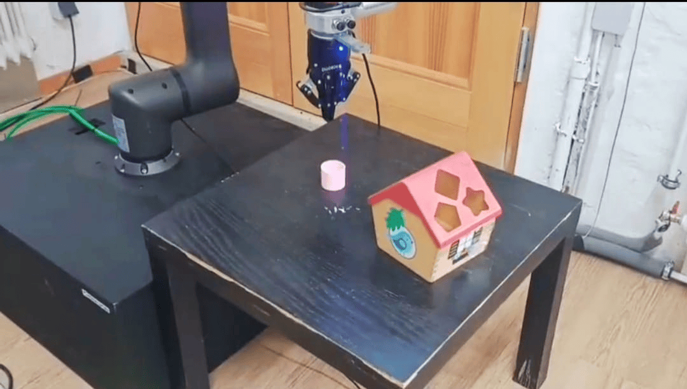
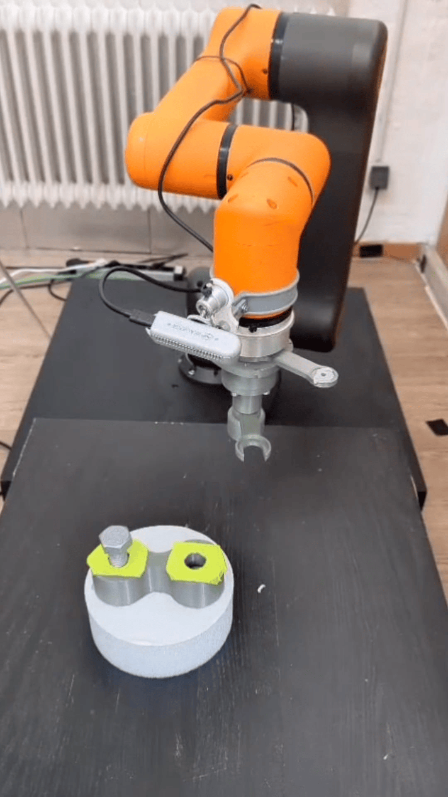

# 🤖 Hanwha_pick_and_place_shape_sorter_&_screw_in_bolt

Welcome to our project for the **LeRobot Worldwide Hackathon 2025**!

We're excited to share our work on creating a **real-world dataset** using the **Hanwha Robotics HCR-5** collaborative robot arm, focused specifically on **pick-and-place tasks** in a **shape sorter setup**.

## 📦 Dataset Overview

To build this dataset, we:

- Set up the system for **teleoperation, recording, and calibration**
- Collected **50 episodes** of high-quality **human demonstrations**

These demonstrations serve as the foundation for training imitation learning policies in real-world robotic manipulation tasks.

👉 **Download the dataset here**:  
🔗 [https://huggingface.co/datasets/LeRobot-worldwide-hackathon/315-vectioneer-Hanwha_pickandplace_shape_sorter](https://huggingface.co/datasets/LeRobot-worldwide-hackathon/315-vectioneer-Hanwha_pickandplace_shape_sorter)
🔗 [https://huggingface.co/datasets/LeRobot-worldwide-hackathon/315-vectioneer-Hanwha_screw_in_bolt](https://huggingface.co/datasets/LeRobot-worldwide-hackathon/315-vectioneer-Hanwha_screw_in_bolt)

## 🧠 Policies Trained

We trained two state-of-the-art policies using this dataset:

- **ACT (Action Chunking Transformer)**  
- **Smol VLA** from Hugging Face’s **LeRobot** library

### 📈 Results

- **Smol VLA** showed strong performance across our setup, with consistent and successful pick-and-place executions.
- **ACT** struggled particularly with the **grasping phase**, likely due to the complexity of object shapes and placement angles.

=======
  
## 🎥 Demo Videos

**Demo 1 – Policy Performance (Smol VLA & ACT)**  

**Demo 2 – Data Collection via Teleoperation**  

> *Click the thumbnails above to watch the videos on Google Drive.*

---

## 🔧 Tech Stack

- **Robot:** Hanwha Robotics HCR-5
- **Library:** Hugging Face [LeRobot](https://huggingface.co/lerobot)
- **Policies:** ACT, Smol VLA
- **Data Collection:** Teleoperated control with custom calibration pipeline(Space_mouse)

---

## 🧑‍💻 Team

Made with 💡 during the **LeRobot Worldwide Hackathon 2025** by [Vishnu,Siddharth,Edil,Anshul].

